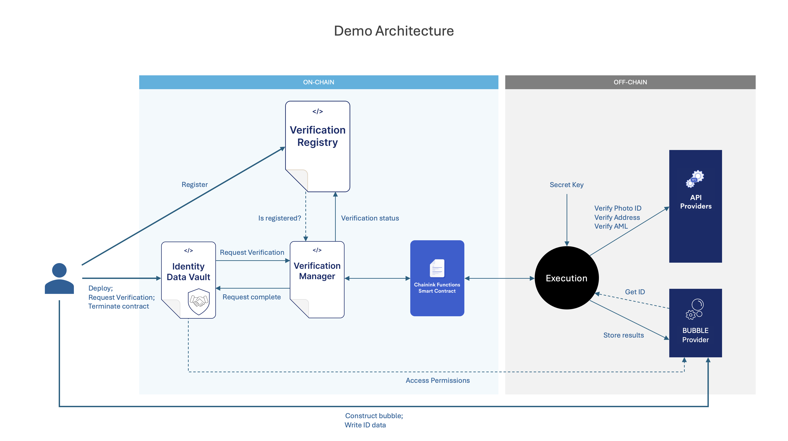
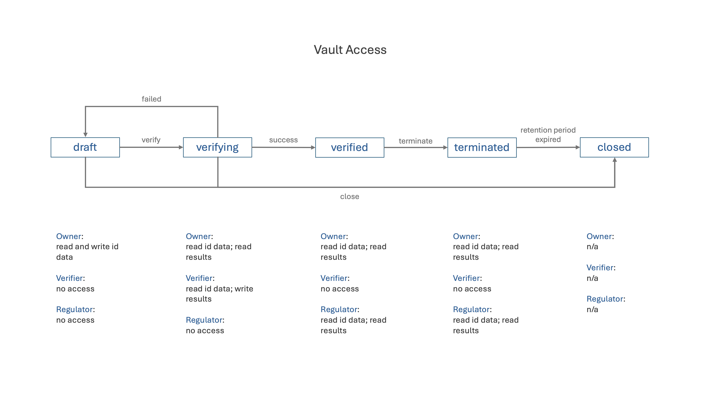

# ID Verification

Proof-of-concept combining Chainlink Functions and Bubble Protocol to implement an automated, decentralised KYC verification service while protecting the owner's data.

## Concept

A *Verification Registry* is maintained on-chain to allow defi dapps to check whether a particular address is KYC verified. 

To get verified, a user connects their wallet to a hypothetical verification dapp which creates a secure off-chain *Identity Data Vault* and prompts the user to upload their identity data. Once uploaded, the user registers their vault with the on-chain registry and initiates verification with the automated verification service. The verification service records the result in the registry. The vault controls the data throughout the service life cycle.

*The vault automatically complies with both GDPR and AML regulations. During verification the user's data is made available only to the verification service. If verification is successful then the vault is locked, hiding the data away from everyone except the user (and perhaps the regulator). If the user terminates the contract they are deregistered from the registry and the data is retained for 5 years to comply with AML regulations. The vault smart contract acts a Service Level Agreement for the access and use of the user's data.*

## Architecture

The verification service is executed by Chainlink Functions. The vault is a custom bubble that complies with Bubble Protocol and is held on a provider of the user's choice.

*This POC is configured for the [Polygon Amoy testnet](https://polygon.technology/blog/introducing-the-amoy-testnet-for-polygon-pos). To use a [different network](https://docs.chain.link/chainlink-functions/supported-networks), change the hard coded configuration in the [ChainlinkConsumer](./contracts/ChainlinkConsumer.sol) source.*

The user (via an app - not yet created) deploys an [`IdentityDataVault`](./contracts/IdentityDataVault.sol) contract and creates the off-chain bubble on a service of their choice (e.g. https://vault.bubbleprotocol.com). The user writes their identity data to the vault then calls the `register` and `verifyIdentity` methods of their contract. 

The [`VerificationManager`](./contracts/VerificationManager.sol) is a Chainlink Functions Consumer that manages the verification process and holds the source code to be executed off-chain. When initiated by the `verifyIdentity` method in the user's contract, it calls the Chainlink Functions Router which executes the source code on the Decentralised Oracle Network (DON) - see the [chainlink docs](https://docs.chain.link/chainlink-functions/resources/architecture). The execution retrieves the identity data from the user's vault and verifies it,  passing it back to the `VerificationManager` which records it in the [`VerificationRegistry`](./contracts/VerificationRegistry.sol) and informs the user's contract. Detailed results are written to the vault to support regulator audits.

The user's contract is a *Smart Data Access* contract that controls an off-chain [bubble](https://github.com/Bubble-Protocol/bubble-sdk#bubbles). The bubble is held on a provider that the user trusts with their data. The contract strictly controls access to the data in the bubble throughout the service life cycle, acting as an on-chain service level agreement. The access controls change as the service passes through its life cycle in accordance with the following state/transition diagram. Once the contract is `closed` the bubble, along with all it's data, is deleted.

## Future Work

### Expand The Verification Service
The [verification service code](./functions/verifyId.js) is deliberately kept simple in this example and always returns success. It contains placeholders for using off-chain api services to obtain the data necessary for identity verification, address verification and sanctions/PEP screening.

Also note that Chainlink Functions restricts execution to 5 api calls at this time, two of which are used to fetch the user's data and record the results in the vault.

### Use Secrets
The verification service needs a private key to access the user's vault. During the verification process the vault gives access to any address with the `VERIFICATION_MANAGER_ROLE` in the registry. This private key is currently hard coded in the function source code held in the [`VerificationManager`](./contracts/VerificationManager.sol). It should be modified to use the [Secrets](https://docs.chain.link/chainlink-functions/resources/secrets) capabilities of Chainlink Functions.

### Encryption
The vault is unencrypted for this POC but can easily be encrypted using Bubble Protocol's [encryption policies](https://github.com/Bubble-Protocol/bubble-sdk/tree/main/packages/client#encryption).

### Add A Regulator Role
The regulator role seen in the state/transition diagram above has not been implemented in the user contract. The role could be made quite smart, for example requiring the regulator to initiate an audit on-chain before the bubble permits access.

### DApp
There is no frontend user app for this POC.

## Testing
Smart contract unit tests are available in the [tests](./contracts/tests/) folder. They use a test router instead of the chainlink router. They are designed to be run in [Remix](https://remix.ethereum.org/).

The [verification service code](./functions/verifyId.js) can be run in the [Chainlink Functions Playground](https://functions.chain.link/playground).

